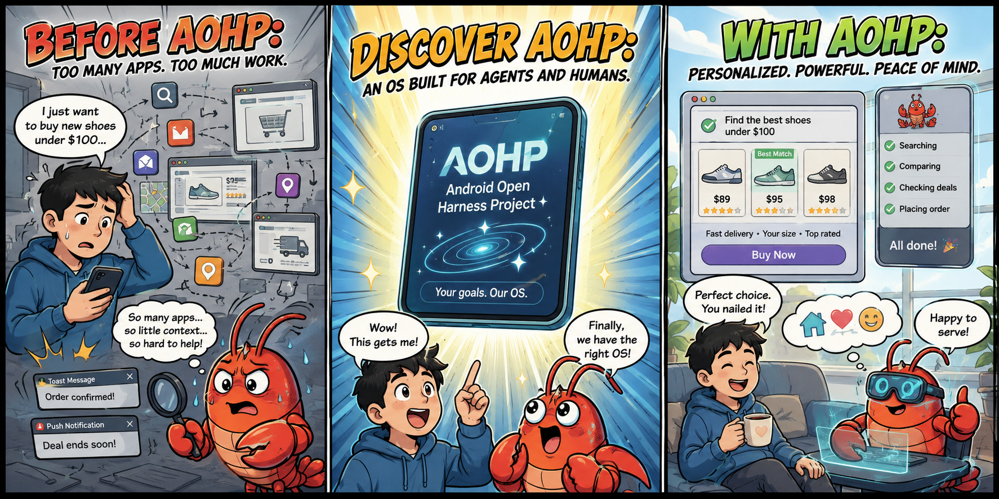
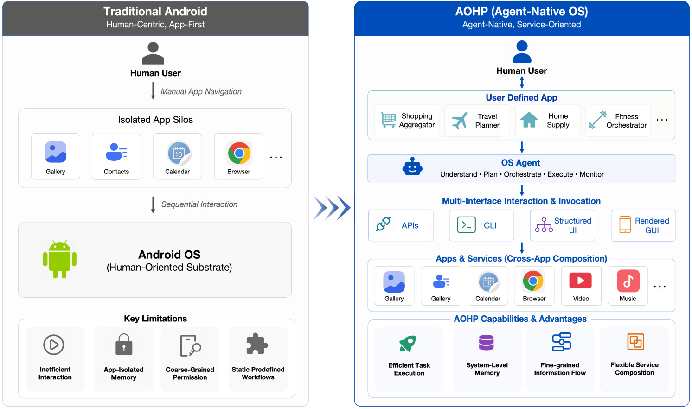
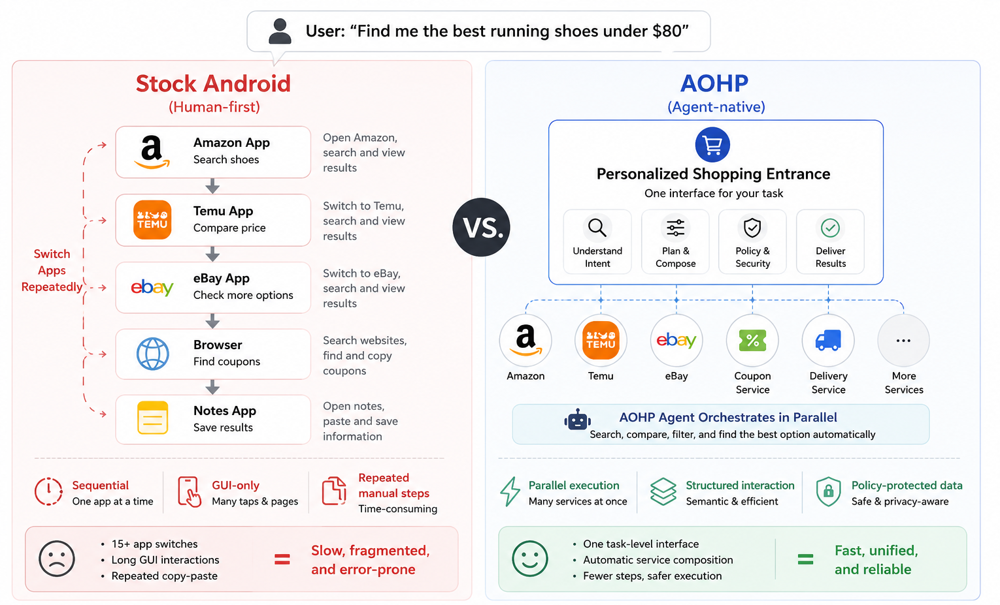
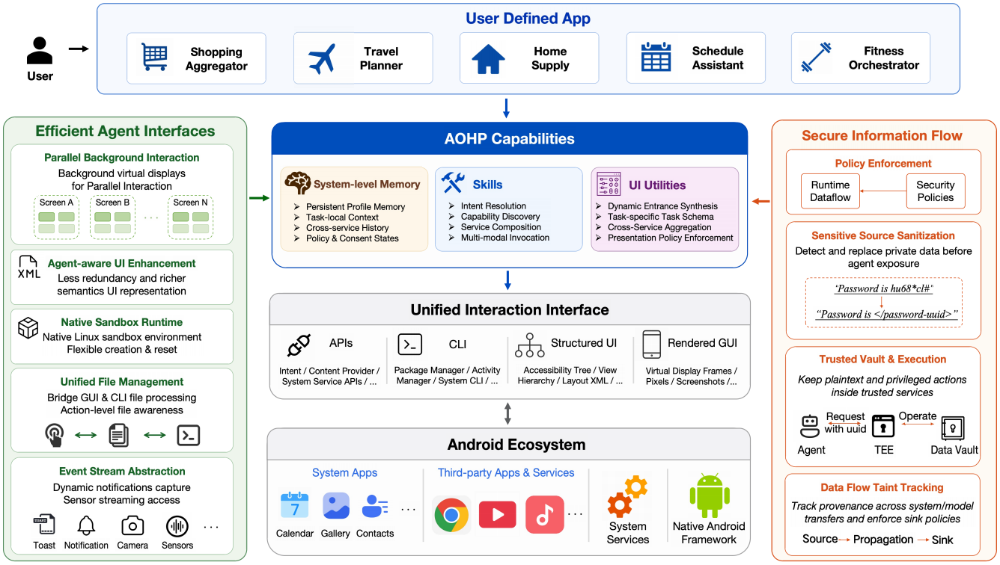
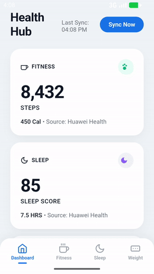
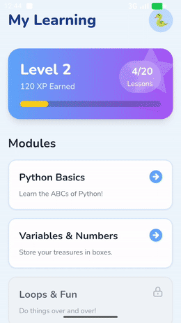
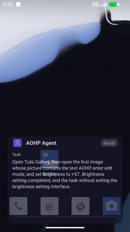
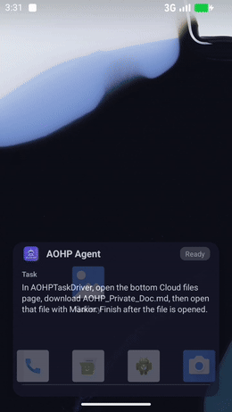
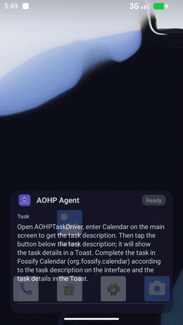

<h1 align="center">AOHP: Android Open Harness Project</h1>

<p align="center">
  <strong>An Open-Source OS-Level Agent Harness for Personalized, Efficient and Secure Interaction</strong>
</p>

<p align="center">
  <strong>Today's OS Serves Humans 👨‍💻. Tomorrow's Tenants will be Agents 🤖.</strong>
</p>

**🎬 [See Demos](#real-world-demos)**: Watch User-Defined Apps generated from a single intent, and agents completing real mobile tasks through AOHP's capabilities.

<p align="center">
  <a href="https://github.com/aohp-os/"></a>
  <a href="#real-world-demos"></a>
  <a href="#evaluation-highlights"></a>
  <a href="#"></a>
  <a href="LICENSE"></a>
</p>

<p align="center">
  <a href="https://source.android.com/"></a>
  <a href="https://github.com/openclaw/openclaw"></a>
</p>

<p align="center">
  <a href="doc/README.zh-CN.md">中文文档</a> ·
  <a href="doc/DEVELOPMENT.md">Development Guide</a> ·
  <a href="doc/DEVELOPMENT.zh-CN.md">开发指南</a>
</p>
<p align="center">
  
</p>


---

## Why AOHP?

AI agents are becoming active operators of personal computing systems: invoking tools, manipulating applications, and completing multi-step tasks on behalf of users. Yet existing operating systems still assume that **humans** are the primary users, creating fundamental mismatches in efficiency, safety, and accountability when agents become long-running system tenants.

**AOHP** addresses this by redesigning Android as an **agent-native operating environment**. Rather than replacing the existing app ecosystem, AOHP preserves Android's hardware support, open-source framework, and application compatibility while adding system mechanisms that make services callable, composable, personalized, efficient, and auditable for OS-level agents.

### Traditional Android vs. AOHP

Stock Android keeps the human at the center: manual navigation across **isolated app silos**, sequential interaction, and a human-oriented OS substrate. AOHP introduces **user-defined task apps**, an **OS agent** that understands, plans, orchestrates, executes, and monitors tasks, multi-interface invocation (API, CLI, structured UI, and rendered GUI), and **cross-app service composition**. The result is a shift from an app-first model to an agent-native, service-oriented system.

<p align="center">
  
</p>

### Example: one shopping task, two experiences

Consider the intent *"Find me the best running shoes under $80."* On stock Android, the user must move sequentially across Amazon, Temu, eBay, the browser, and Notes, performing repeated GUI operations, copy-paste steps, and app switches. On AOHP, a **personalized shopping entrance** exposes a single task-level interface: the OS agent understands the intent, composes services in **parallel**, applies policy checks, and returns the result.

<p align="center">
  
</p>

---

## Key Design Principles

| Dimension               | Stock Android                                                 | AOHP                                                                               |
| ----------------------- | ------------------------------------------------------------- | ---------------------------------------------------------------------------------- |
| **Primary User**        | Human operators with a single visual attention stream         | AI agents as first-class system tenants alongside humans                           |
| **Interaction Surface** | Fixed, app-defined GUIs rendered for human perception         | Personalized service entrances; APIs, CLIs, and structured UIs for agent operation |
| **Execution Model**     | Single-tenant foreground execution bound to physical displays | Parallel background interaction decoupled from the screen                          |
| **System Memory**       | Fragmented and locked inside individual applications          | OS-managed cross-app memory for task personalization                               |
| **Security & Privacy**  | Coarse-grained app permissions; opaque data flows             | Fine-grained data-flow taint tracking and sandboxed sensitive values               |

---

## Three Core Capabilities

### 1. Personalized Service Composition

AOHP enables the OS to generate and operate **personalized service entrances** for each user. Instead of manually switching among multiple apps, users interact with task-level interfaces that aggregate capabilities across apps and services.

- **Generated Service Entrances** — Task-oriented interfaces backed by OS-managed service composition
- **Capability Discovery** — Cross-app service composition through API, CLI, and GUI channels
- **Cross-Service Personalization** — OS-level memory that survives app boundaries

### 2. Efficient Agent Interfaces

AOHP decouples agent execution from hardware constraints and narrows the semantic gap between system state and model understanding.

- **Parallel Background Interaction** — Lightweight virtual displays for concurrent multi-app execution
- **Agent-Aware UI Enhancement** — Structured UI representations with reduced redundancy and richer semantics
- **Native Sandbox Runtime** — OS-managed execution substrate for code, data processing, and long-running services
- **Unified File Shortcut** — Files treated as first-class task objects at the OS boundary
- **Event Stream Abstraction** — Unified subscription interface for transient notifications and sensor data

### 3. Secure Information Flow

AOHP reduces unnecessary plaintext exposure while preserving the agent's ability to complete legitimate tasks.

- **Policy Enforcement** — Runtime data-flow-based policies with fine-grained semantic context
- **Sensitive Source Sanitization** — Default protection via typed placeholders (e.g., `<payment-card: uuid>`)
- **Trusted Vault & Execution** — Sensitive operations mediated by a trusted executor without exposing plaintext to the agent
- **Data-Flow Taint Tracking** — End-to-end taint propagation with enforcement at system boundaries

---

## Architecture

<p align="center">
  
</p>

A task in AOHP proceeds through five stages:

1. **Intent Expression** — The user expresses intent through a generated entrance, existing app, or system command
2. **Capability Resolution** — The OS agent resolves intent into service capabilities using descriptors and system memory
3. **Execution Path Selection** — API/CLI invocation, structured UI operation, or rendered GUI fallback
4. **Policy Mediation** — All sensitive inputs and state-changing actions pass through the policy and trace layer
5. **Memory & Audit** — Task traces and outcomes are stored as system-level memory for personalization and auditing

---

<a id="real-world-demos"></a>

## 🎬 Real-World Demos

AOHP is not only a design — it ships as a runnable AOSP fork with **AOHPAgentDriver**, built-in **OpenClaw**, **skills**, and a **User-Defined App (UDA)** generator. Below are screen recordings from the real system.

### User-Defined Apps — Intent to App

Give AOHP a natural-language intent; it produces a complete app — PRD, design spec, frontend, and backend — ready to install on the device.

<table align="center">
<tr>
<td align="center" width="33%"><strong>Health Hub</strong><br><sub>Unified Fitness & Sleep Dashboard</sub></td>
<td align="center" width="33%"><strong>Gift Picker</strong><br><sub>Luxury Gift Recommendation for 520</sub></td>
<td align="center" width="33%"><strong>Python Learning Assistant</strong><br><sub>Kid-Friendly Programming Tutor</sub></td>
</tr>
<tr>
<td align="center"><a href="./demos/uda/health_hub_demo.mp4"></a></td>
<td align="center"><a href="./demos/uda/gift_picker_demo.mp4"></a></td>
<td align="center"><a href="./demos/uda/python_learning_assistant_demo.mp4"></a></td>
</tr>
<tr>
<td align="center"><sub>Aggregate fitness and sleep records from Huawei Health, and weight data from Mi Fitness, to generate a unified health management app. The app should be in English and support both portrait and landscape layouts.</sub></td>
<td align="center"><sub>A gift selection app for romantic occasions like 520, helping users choose luxury items (Chanel/Gucci perfumes, Dior bags, Tiffany/VCA necklaces) for their girlfriends, featuring both portrait and landscape responsive layouts.</sub></td>
<td align="center"><sub>My son recently started primary school, and I want him to learn programming (Python). Please help me generate a Python learning App, including knowledge point explanations, exercises, interactive practice, and learning progress. Please use English for the app generation, and it can include both landscape and portrait versions.</sub></td>
</tr>
</table>

### Agent Execution — OpenClaw on AOHP

Benchmark runs invoke **OpenClaw** through **AOHPAgentDriver**, exposing AOHP services as **skills**. Each recording captures the agent phase on a live AOHP device.

<table align="center">
<tr>
<td align="center" width="33%"><strong>UI Micro-operations</strong></td>
<td align="center" width="33%"><strong>File Handling</strong></td>
<td align="center" width="33%"><strong>Event Capture</strong></td>
</tr>
<tr>
<td align="center"><a href="./demos/agent/gallery_brightness.mp4"></a></td>
<td align="center"><a href="./demos/agent/cloud_file_markor.mp4"></a></td>
<td align="center"><a href="./demos/agent/taskdriver_calendar.mp4"></a></td>
</tr>
</table>

---

## Evaluation Highlights

We evaluate AOHP with [OpenClaw](https://github.com/openclaw/openclaw) agents against stock Android on 10 representative tasks:

| Metric               | Improvement |
| -------------------- | ----------- |
| Task Completion Rate | **↑46.7%** |
| Tool Calls           | **↓65.6%**  |
| Duration             | **↓72.2%**  |
| Token Consumption    | **↓73.9%**  |
| LLM Requests         | **↓68.5%**  |

---

## Getting Started

AOHP is built on AOSP and developed through the unified **[aohp](https://github.com/aohp-os/aohp)** framework. This repository hosts project documentation; source trees live in the `aohp-os` GitHub organization and are pulled in via [local_manifests](https://github.com/aohp-os/local_manifests).

### Quick start

```bash
# 1. Clone the dev framework
git clone git@github.com:aohp-os/aohp.git
cd aohp

# 2. Initialize AOSP + AOHP manifests (see guide for mirror/proxy options)
cd AOSP && repo init -b android-latest-release
cd .repo && git clone git@github.com:aohp-os/local_manifests.git && cd ..
repo sync -j4

# 3. Build
bash scripts/build.sh

# 4. Launch Cuttlefish (after envsetup + lunch)
source AOSP/build/envsetup.sh
lunch aosp_cf_x86_64_phone_aohp-trunk_staging-userdebug
sudo -E bash -c 'ulimit -n 65536; '"$ANDROID_HOST_OUT"'/bin/launch_cvd --report_anonymous_usage_stats=n' &
```

Open the emulator at **https://localhost:8443/** (instance 1).

### Full development guide

Setup, networking, multi-instance Cuttlefish, sandbox options, and contribution workflow are documented in:

| Document | Description |
|----------|-------------|
| **[Development Guide](doc/DEVELOPMENT.md)** | Complete English tutorial |
| **[开发指南](doc/DEVELOPMENT.zh-CN.md)** | 完整中文开发教程 |

You can also clone this repo for project overview and updates:

```bash
git clone https://github.com/aohp-os/aohp.git
```

---

## License

AOHP is licensed under the [Apache License, Version 2.0](LICENSE).

---

## Citation

```bibtex
@techreport{aohp2026,
  title={AOHP: An Agent-Native Open Fork of Android},
  author={TBD},
  institution={Institute for AI Industry Research (AIR), Tsinghua University},
  year={2026}
}
```

---

<p align="center">
  <i>The OS is no longer only a substrate for human-operated applications — it becomes the environment in which agents perceive, plan, act, and enforce user intent.</i>
</p>
